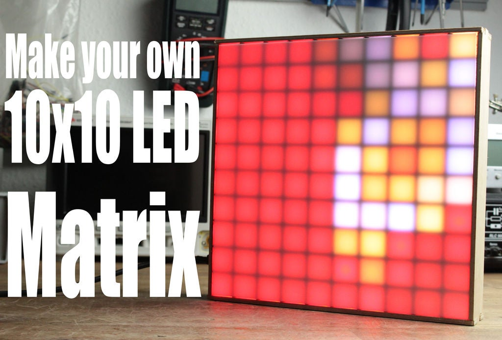

# SinzianaPanel by [GreatScottLab](https://www.instructables.com/member/GreatScottLab/)

> Video of the above board's assembly plus some of the visual routines: [https://www.youtube.com/watch?v=D_QBlFIQk-o](https://www.youtube.com/watch?v=D_QBlFIQk-o) or [click here](media/yt.mp4) for a copied version.

## About
A few years ago I came across a wonderful Instructable titled [Make Your Own 10x10 LED Matrix](https://www.instructables.com/id/Make-Your-Own-10x10-LED-Matrix/), authored by the [GreatScottLab](https://www.instructables.com/member/GreatScottLab/) account.  Embedded in the instructions was a link to a .RAR file containing code designed to be run on an Arduino connected to a WS2812 (aka "NeoPixel") array, which would then display a number of fun visual patterns.  This makes the code ideal for testing homemade LED arrays, which is precisely what I used it for.

However I felt that this code would be easier to modify and interact with if it were to be published to a public git repository.  To that end I copied the code and have posted it here in a repository sharing the original .RAR file's name.  All accompanying media (pictures, video) in this repository were taken directly from the Instructable and/or the [GreatScott! YouTub Channel](https://www.youtube.com/channel/UC6mIxFTvXkWQVEHPsEdflzQ).

## License / Disclaimer
I take absolutely no credit for the creation of this code.  Additionally, I am unaware of what license originally accompanied this code, so please keep that in mind before employing it in any commercial capacity.  Should the original owner desire its removal from GitHub I will happily comply and issue an apology.
